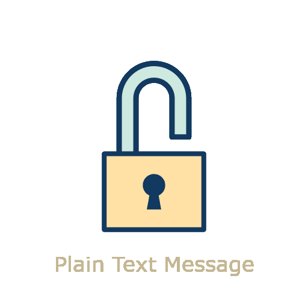

<p align="center">
  <picture>
    
  </picture>
</p>

## 📚 About

<picture>
  
</picture>

This repository contains the final project implementation for the **Computer Security (CIC0201)** course at the **University of Brasília (UnB)**. Developed during my 6th semester in Computer Science, the project focuses on creating cryptographic tools and exploring their fundamental principles.

The project is divided into two main parts: one for **symmetric cryptography** and one for **asymmetric cryptography with digital signatures**. By implementing the **AES** and **RSA** algorithms, I was able to deepen my understanding of how the theory behind data security is applied in practice, from block encryption to key generation and digital signature verification.

This experience was crucial for solidifying my knowledge of topics such as modes of operation, data integrity, and authentication, demonstrating the power of these tools to protect information in a digital environment.

## 📌 Features

### Symmetric Cryptography (AES-CTR/GCM)

- **AES Block Cipher:** Implementation of the AES block cipher with 128-bit key and block sizes.
- **CTR Mode of Operation:** Use of `Counter Mode (CTR)` to encrypt and decrypt files of any size.
- **Authenticated GCM Mode:** An extra implementation of `Galois/Counter Mode (GCM)` to ensure data authenticity and integrity.
- **Visual Tests:** Encryption of a picture (`selfie.jpg`) with varying numbers of AES rounds to demonstrate the algorithm's effect.

### Asymmetric Cryptography and Digital Signatures (RSA)

- **RSA Key Generation:** Creation of public and private keys with primes of 1024 bits or more.
- **RSA Encryption/Decryption:** Implementation of the asymmetric encryption and decryption processes.
- **Digital Signature:** `SHA-3 hash` calculation and creation of a digital signature for a document.
- **Signature Verification:** The process of verifying signed documents for authenticity.

## 🛠 Built With

<p align="left">
  
</p>

- **Language:** Python
- **Algorithms:** AES, RSA, SHA-3
- **Libraries:** `hashlib`, `PIL (Pillow)`

## 👨‍💻 How to Run

### Prerequisites

Make sure you have **Python 3** installed.

### Installing Dependencies

Install the necessary libraries using `pip`:

```bash
pip install Pillow
````

```bash
pip install cryptography
```

*(The `hashlib` and `os` libraries come pre-installed with standard Python.)*

### Usage Instructions

The scripts are modular and can be run separately. The necessary files for the tests are located in the `AES/arquivos/` and `RSA/arquivos/` folders.

Example of how to run the test scripts:

```bash
python AES/aes_test.py
```

```bash
python RSA/rsa_test.py
```

## 👥 Author

This project was developed by:

  - **Daniel Luz** — [GitHub](https://github.com/dancpluz)

## 🤝 Contributions / Acknowledgements

This project was carried out for the **Computer Security** course in the Computer Science Department at the **University of Brasília (UnB)**.

  - **Technical Report:** The complete project report, with all the theoretical background and implementation details, can be accessed at: [https://www.overleaf.com/read/bfchdyydqrmv\#dbb63d](https://www.overleaf.com/read/bfchdyydqrmv#dbb63d).

<details>
  <summary>Click to view status</summary>

  - [x] Implementation of the AES cipher (128 bits).
  - [x] Implementation of CTR mode of operation.
  - [x] Implementation of the RSA asymmetric cipher (1024+ bits).
  - [x] Implementation of Digital Signatures.
  - [x] Generation and verification of SHA-3 hashes.

</details>
